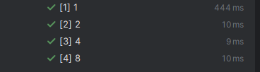

# JSON input structure

The input JSON structure presents as an array of following items:

```
{
    "firstName": "Liam",
    "lastName": "Taylor",
    "birthDay": "1998-07-15",
    "subscription": "6months, spa, massage"
  }
```

# JSON output structure

The output structure.

```
<statistics><item><value>massage</value><count>304</count></item>
<item><value>spa</value><count>204</count></item>
<item><value>sauna</value><count>194</count></item>
```
# Multithreading Tests
